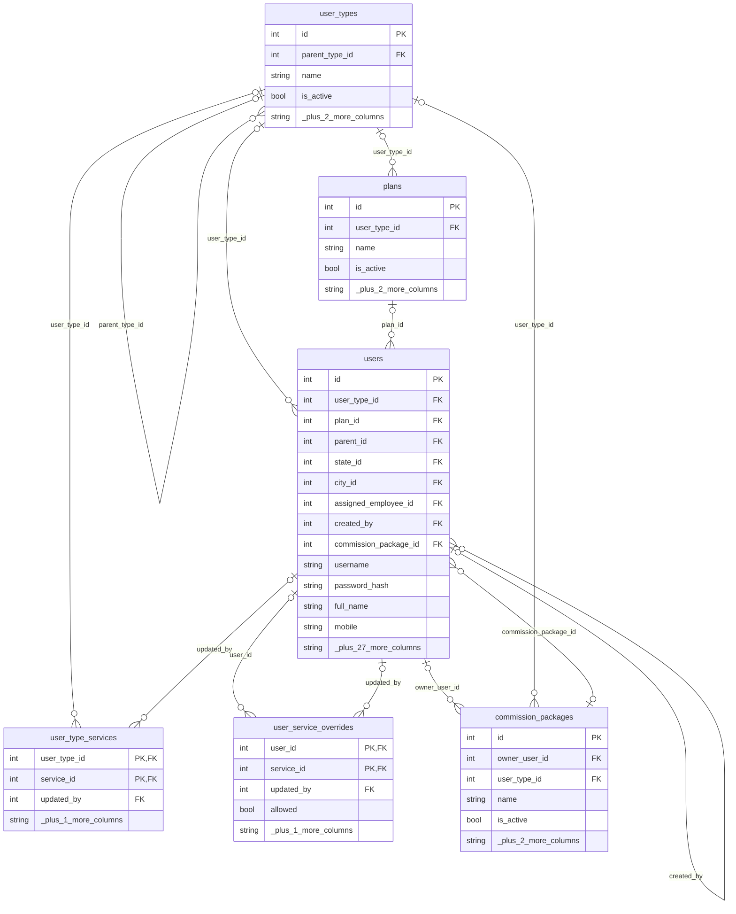
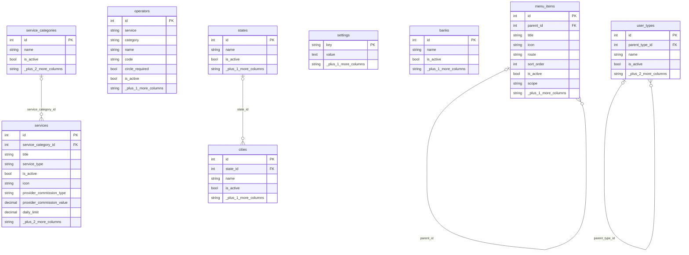
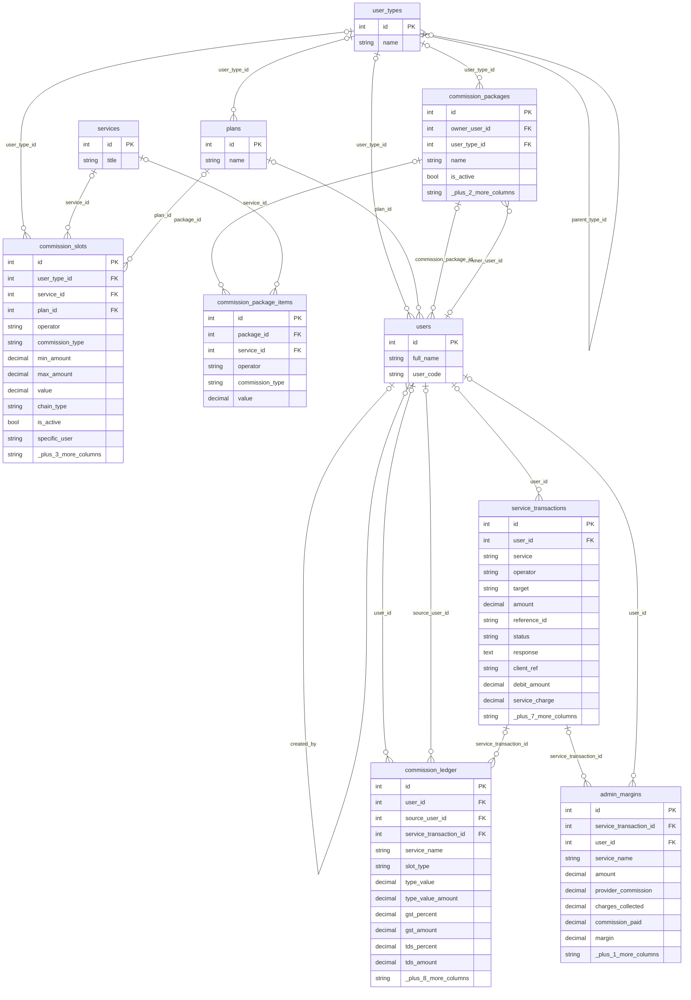
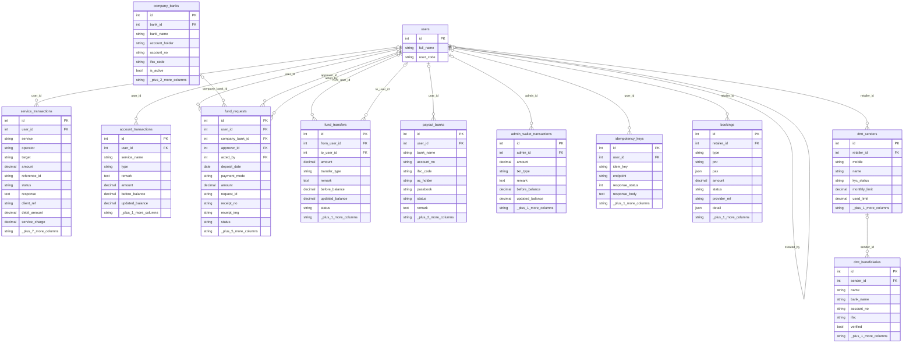
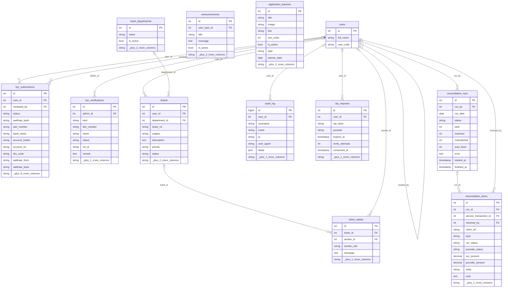

# Database ER diagram

Generated from the live schema (PostgreSQL, 40 tables, 60 foreign keys). Crow's foot: `||` exactly one, `|o` zero or one, `o{` zero or many. `PK` primary key, `FK` foreign key (the label on a line is the FK column). Only keys and the most important columns are drawn; a `_plus_N_more_columns` row says how many were left out.

Open in GitHub (renders automatically), VS Code with a Mermaid preview extension, or double-click `er-diagram.html` for a standalone page.

## How the pieces connect (one line each)

- `users.parent_id` -> `users.id`: the chain Admin -> Super Distributor -> Distributor -> Retailer (commission follows it). `users.user_type_id` -> `user_types`; `user_types.parent_type_id` -> `user_types` is the tree that decides who may create whom.
- `service_transactions` (a recharge / payout) -> `commission_ledger` (one row per person paid, `level` 0 = the user, 1+ = uplines, `source_user_id` = who transacted) and -> `admin_margins` (what the company keeps).
- `commission_slots` = admin rates per user type + service + plan; `commission_packages` / `commission_package_items` = what an upline re-shares with its direct users.
- `account_transactions` = the wallet statement; `users.wallet_balance` is the running balance.

## 1. Users and hierarchy

Who exists, how they are arranged (parent chain) and what each type may use.

Tables: `users` (~4 rows locally), `user_types` (~5 rows locally), `plans` (~4 rows locally), `user_type_services` (~22 rows locally), `user_service_overrides` (~18 rows locally), `commission_packages` (~0 rows locally)

## 2. Services, menu and master data

What can be sold, the sidebar menu, operators and lookups.

Tables: `service_categories` (~0 rows locally), `services` (~22 rows locally), `operators` (~0 rows locally), `menu_items` (~65 rows locally), `settings` (~0 rows locally), `banks` (~0 rows locally), `states` (~0 rows locally), `cities` (~250 rows locally), `user_types` (~5 rows locally)

## 3. Commission and margin

Slabs, packages, every commission payout (ledger) and what the company keeps.

Tables: `commission_slots` (~7 rows locally), `commission_packages` (~0 rows locally), `commission_package_items` (~0 rows locally), `commission_ledger` (~3 rows locally), `admin_margins` (~0 rows locally), `service_transactions` (~5 rows locally)

## 4. Money: wallet, transactions, funds

Wallet history, service transactions, fund requests/transfers, banks and bookings.

Tables: `service_transactions` (~5 rows locally), `account_transactions` (~165 rows locally), `fund_requests` (~2 rows locally), `fund_transfers` (~70 rows locally), `company_banks` (~0 rows locally), `payout_banks` (~0 rows locally), `admin_wallet_transactions` (~0 rows locally), `idempotency_keys` (~2 rows locally), `bookings` (~0 rows locally), `dmt_senders` (~0 rows locally), `dmt_beneficiaries` (~0 rows locally)

## 5. KYC, support, audit and reconciliation

Verification, tickets, security trail, OTPs and daily reconciliation.

Tables: `kyc_submissions` (~0 rows locally), `kyc_verifications` (~0 rows locally), `tickets` (~0 rows locally), `ticket_replies` (~0 rows locally), `ticket_departments` (~0 rows locally), `audit_log` (~532 rows locally), `otp_requests` (~0 rows locally), `announcements` (~0 rows locally), `application_banners` (~0 rows locally), `reconciliation_runs` (~4 rows locally), `reconciliation_items` (~0 rows locally)

