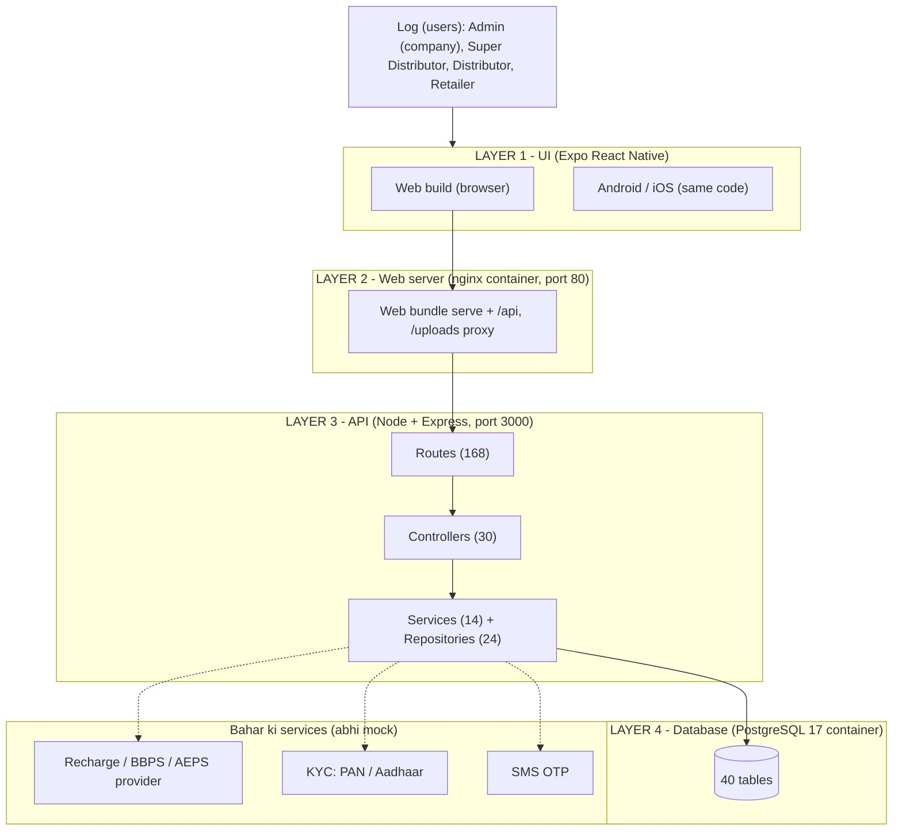
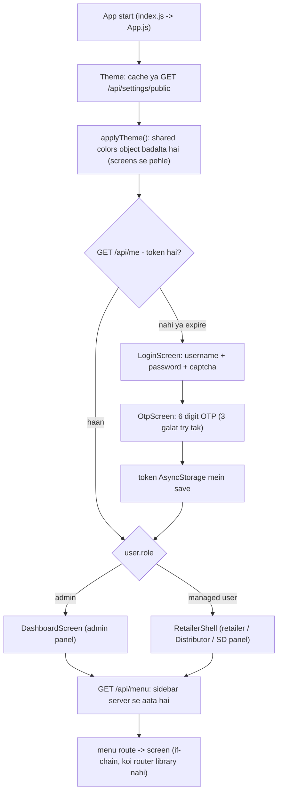
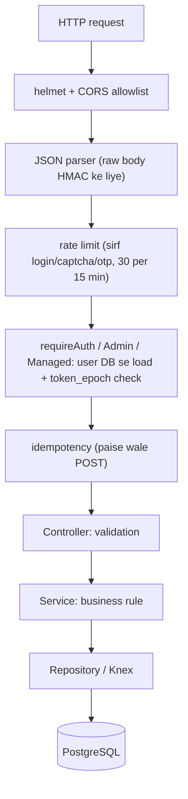
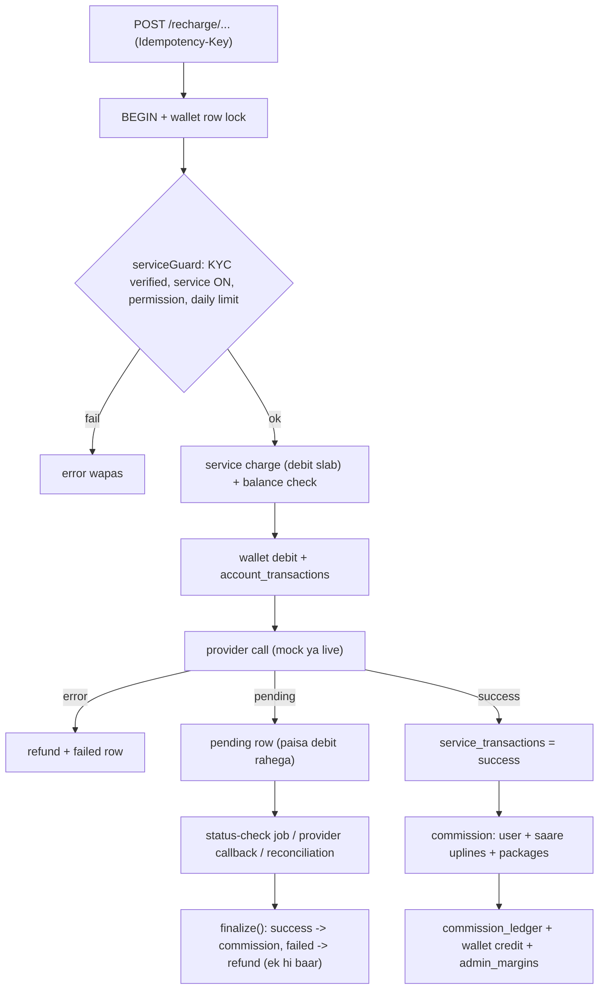
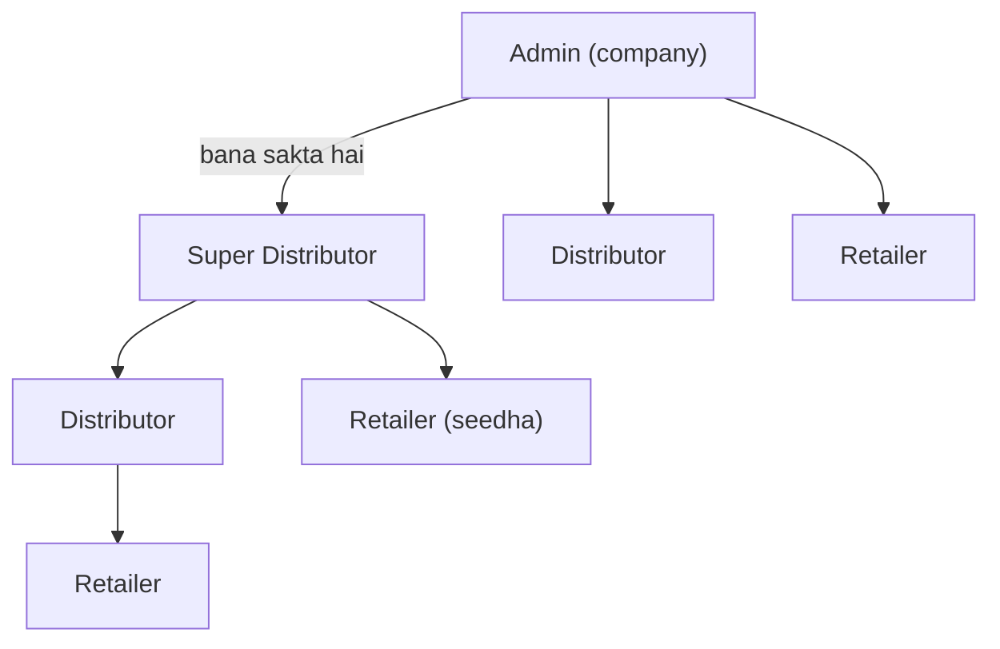
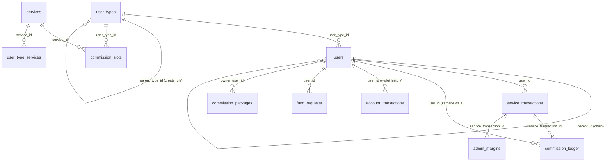
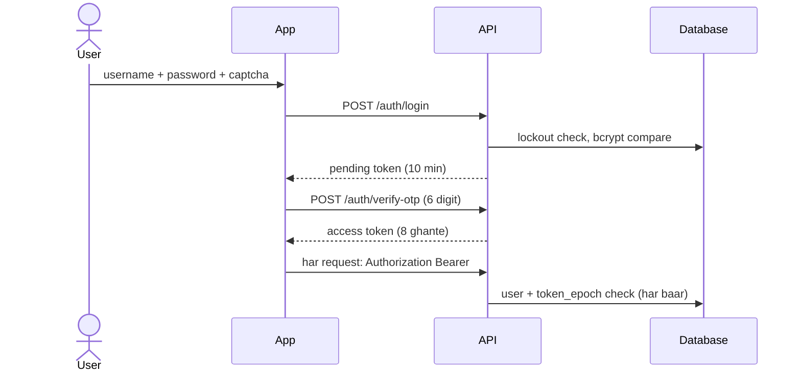
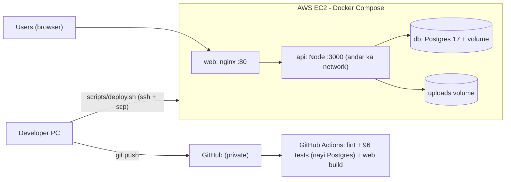
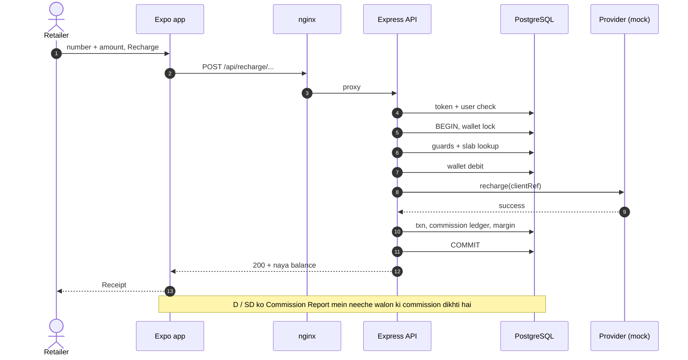

# AEPS Portal - System Design (abhi jaisa chal raha hai)

Layer-wise: UI -> Web server -> API -> Database, plus business engines, security, deployment aur known gaps. Diagrams Mermaid mein hain (GitHub par apne aap dikhte hain). Standalone page: `docs/system-design.html`. Database ke poore tables: `docs/er-diagram.html`.

## 1. Ek nazar mein (poora picture)

AEPS / fintech portal ek monorepo hai: `app/` (UI, Expo React Native) aur `api/` (Node.js + Express + PostgreSQL). Ek hi UI code web, Android aur iOS teeno ke liye hai. Production par abhi web version AWS ke ek server par Docker se chal raha hai.

*Chaar layers: UI -> Web server -> API -> Database. Dotted line = bahar ki service (abhi mock mode mein).*

| Cheez | Kitna | Kahan |
|---|---|---|
| UI screens | 53 (38 admin/shared + 15 retailer panel) | app/src/screens |
| UI api methods | ~165 (31 groups + 20 flat) | app/src/api/client.js |
| API routes | 168 | api/src/routes/api.routes.js |
| Controllers / Repositories / Services | 30 / 24 / 14 | api/src/controllers, repositories, services |
| Database tables | 40 (60 foreign keys) | PostgreSQL; schema api/migrations (39 files) |
| Tests | 96 (16 files), CI par bhi chalte hain | api/test |
| Commits | 35 (27 Sep - 5 Oct 2026) | git log |

## 2. Layer 1 - UI (app/)

Expo ~57 + React 19 + react-native-web. Koi router library, Redux ya Context nahi hai: app ek chhoti state machine hai aur har screen apni state khud rakhti hai.

*App ka boot aur login flow*

| Hissa | Kaise kaam karta hai |
|---|---|
| Do panel, ek app | Sirf ek client-side branch hai: `user.role === admin` to DashboardScreen, baaki sab RetailerShell. Distributor / SD ka alag panel nahi, unka "My Network" menu server se aata hai aur wahi admin screens `network` prop ke saath chalti hain. |
| Menu (database-driven) | Sidebar `menu_items` table se banta hai (GET /api/menu), role ke hisaab se server filter karta hai. Naya menu row = naya screen, UI code nahi badalna (agar screen pehle se hai). |
| Screen pattern | 13 master screens: list <-> form toggle (in-page form, modal nahi), debounced search, optimistic status switch, pagination. Delete par confirm modal. |
| DataGrid (shared) | Header click = sort (asc, desc, off), har column ke neeche filter. Sorting/filtering server karta hai poore data par (?sort=&dir=&f_col=). Status aur Action columns right par pinned (web). 23 screens use karti hain. |
| API client | Ek `request()`: Bearer token, JSON, `ApiError` (status, code, poora body), `Idempotency-Key` paise wali calls par, multipart upload (image, KYC, banner). |
| Theme | `theme.js` ka `colors` ek mutable object hai. Admin ka chuna primary/secondary color startup par lagta hai, isliye theme badalne par page reload hota hai. |
| Responsive | Width >= 860 par fixed sidebar, uske neeche drawer. Web par poora app 85% zoom par (zyada dense dikhne ke liye). |
| Token | AsyncStorage (web par localStorage), keys `aeps.accessToken` aur `aeps.theme`. Logout par server token revoke karta hai. |

| Shared component | Kaam |
|---|---|
| UI.js | Select (searchable), Button, TextField, DateField, Alert, Card, StatusBadge, Logo |
| DataGrid.js | Grid + useGrid / useGridReload / gridParams |
| Fiori.js | SAP-Fiori jaise page/panel/toolbar/pager (5 screens mein) |
| Icon.js, MenuSearch.js, Receipt.js | SVG icons (menu icon naam se), menu search, transaction receipt modal |

| Screens ka group | Kitni | Udaharan |
|---|---|---|
| Auth | 2 | LoginScreen, OtpScreen |
| Shell | 2 | DashboardScreen, RetailerShell |
| Admin masters / CRUD | 16 | UserManager, ServiceMaster, CommissionSlot, CommissionPackage, PlanMaster, CompanyBank, UserTypeMaster |
| Reports / lists | 9 | TaxReport (GST/TDS/Commission), AdminMargin, AccountHistory, PendingTransactions, Reconciliation |
| Operations | 6 | FundRequest, FundTransfer, KycRequest, PanVerify, AadhaarVerify |
| Retailer panel | 13 + 2 helpers | MobileRecharge, DthRecharge, BillPayment, Aeps, MoneyTransfer, Booking, MyCommissionSlab, Kyc |

## 3. Layer 2 - Web server aur delivery

UI ka build (expo export --platform web) ek static bundle banta hai. Usse nginx container serve karta hai aur wahi API ke saamne proxy bhi hai, isliye browser ko sirf ek address (port 80) dikhta hai.

- `nginx`: `/` par SPA serve (try_files -> index.html), `/api/` aur `/uploads/` ko `http://api:3000` par proxy, gzip on, upload limit 12 MB.
- Same-origin: UI build mein API URL khali hai, to browser relative `/api` call karta hai. CORS tab bhi API par laga hai (CORS_ORIGINS allowlist).
- Sirf `web` container bahar khula hai (port 80). `api` aur `db` sirf Docker ke andar ke network par hain.

## 4. Layer 3 - API (api/)

Node 20 + Express 4 + Knex. Koi build step nahi. Har request ek hi raste se guzarti hai: middleware -> route -> controller -> service/repository -> database.

*Ek request ka safar*

| Route area | Udaharan | Kaun call kar sakta hai |
|---|---|---|
| Auth | GET /auth/captcha, POST /auth/login, /auth/verify-otp | public (rate-limited) / pending token |
| Session, menu, uploads | /me, /menu, /account/change-password, /uploads/image | koi bhi logged-in user |
| Admin masters | service-categories, user-types, services, plans, banks, company-banks, announcements, banners | sirf admin |
| Users manager | /users CRUD, /users/:id/change-impact, /users/:id/fund | sirf admin |
| Permissions aur commission | /service-permissions/*, /commission-slots (+chain-gaps), /commission-packages | sirf admin |
| Reports | /account-history, /gst-report, /tds-report, /commission-report, /admin-margin-report, /admin/dashboard | sirf admin |
| KYC aur operations | /kyc-requests, /verify/pan, /pending-transactions, /reconciliation/* | sirf admin |
| Retailer panel | /retailer/summary, /retailer/commission-report, /retailer/my-commission-slab | managed user (apna data) |
| Paid services | /recharge/*, /bbps/*, /aeps/*, /dmt/*, /move-to-bank, /booking/* | managed user; paise wale POST par idempotency |
| Network panel | /network/users, /network/packages, /network/fund-transfer, /network/report, /network/summary | managed + type ke neeche users ho (Distributor / SD) |
| Provider webhook | POST /provider-callback | public, HMAC signature zaroori |
| Health | GET /api/health -> {ok, mode, adapters, version} | public |

| Layer ke andar | Kya hai |
|---|---|
| Controllers (30) | Input validation, error codes, response shape. |
| Repositories (24) | Knex queries (joins, filters). Server-side grid ke liye whitelisted sort/filter columns (`utils/gridQuery.js`), isliye user ka diya column naam SQL mein nahi jaata. |
| Services (14) | txnPipeline (paisa), commission, serviceGuard, servicePermission, fundRequest, reconciliation + jobs, otp, captcha, token, txnAuth, providers / sms / kyc adapters, menu. |
| Dhyan | Repository layer exclusive nahi hai: kuch controllers aur services seedha Knex bhi chalate hain. |

| Background job | Kitni der mein | Kaam |
|---|---|---|
| Status check | har 300 sec | Pending transactions (60 sec se purani, max 50) ka provider se status poochkar finalize |
| Daily reconciliation | roz 1 baje ke baad | Kal ke transactions ko provider report se milana; farak ko reconciliation_items mein daalna |

*Dono Postgres advisory lock lete hain, isliye ek hi instance chalata hai.*

## 5. Business engines (API ke andar ka dimaag)

**A. Paise ka pipeline** (`txnPipeline.service.js`): har paid service (recharge, BBPS, AEPS, DMT, booking...) isi se guzarti hai. Sab kuch ek DB transaction mein hota hai.

*Paise ka flow*

**B. Hierarchy aur commission:** jo user banata hai wahi parent hai. Commission poori parent chain (10 level tak) mein baantta hai: transact karne wale ko apna slab, har upline ko uska apna "chain" slab.

*Kaun kise bana sakta hai (User Type tree se tay hota hai, User Type Master mein badal sakte hain)*

| Niyam | Kaise lagta hai |
|---|---|
| Create rule | User apne type ke neeche ke saare types bana sakta hai (SD: D aur R, D: R, R: kuch nahi). Admin ke liye parent khali = admin; galat type ka parent = PARENT_TYPE_MISMATCH. |
| Commission slab | `commission_slots`: user type + service + plan + amount range (+ operator, + specific user). Credit = commission milta hai, Debit = service charge katta hai. "self" = sirf apne txn par, "chain" = neeche walon ke txn par bhi. |
| Commission packages | Upline apne hisse mein se direct neeche walon ko alag rate de sakta hai. Admin ka total kharcha nahi badalta. |
| Skip level | Retailer seedha SD ke neeche ho to SD ko sirf apna chain slab milta hai; beech wale Distributor ka hissa company ke paas (margin) rehta hai. |
| Admin margin | margin = provider commission + charges - commission paid (har transaction par `admin_margins` mein). |
| Service permission | can = service ON aur (user override ya type default). Admin Service Permissions screen se type-wise aur user-wise control karta hai. |
| Role / parent badalna | Naya type parent ke neeche fit hona chahiye; neeche ke users fit na hon to shift karne padte hain; plan/package saaf, user logout, sab ek transaction mein; purani commission history nahi badalti. |
| Fund request | Jisne user banaya wahi approve karta hai: admin ka user = bank deposit se wallet credit, D/SD ka user = D/SD ke wallet se transfer. |

## 6. Layer 4 - Database (PostgreSQL 17)

40 tables, 60 foreign keys. Schema sirf Knex migrations se badalta hai (39 files, server start par apne aap chalti hain). Poora detailed diagram: `docs/er-diagram.html`.

*Sabse zaroori tables aur unke rishte*

| Area | Tables |
|---|---|
| Users aur hierarchy | users (40 columns: admin + sab managed users), user_types, plans, user_type_services, user_service_overrides |
| Services aur master | services, service_categories, operators, menu_items, settings, banks, states, cities |
| Commission | commission_slots, commission_packages, commission_package_items, commission_ledger, admin_margins |
| Paisa | service_transactions, account_transactions, fund_requests, fund_transfers, company_banks, payout_banks, idempotency_keys, bookings, dmt_* |
| KYC, support, security | kyc_submissions, kyc_verifications, tickets, ticket_replies, audit_log, otp_requests, announcements, application_banners, reconciliation_runs, reconciliation_items |

- `users` ek hi table mein admin (role=admin, user_type_id null) aur saare managed users (user_type_id bhara) hain. `users.wallet_balance` chalta hua balance hai, `account_transactions` uska statement.
- `commission_ledger` mein har payout ek row: level 0 = transact karne wala, 1+ = upline; `source_user_id` = kisne transaction kiya.
- Seeds (11 files) demo data daalte hain, sirf `RUN_SEED=true` par. Production par abhi RUN_SEED=false hai.

## 7. Bahar ki services (adapters)

Har bahar ki cheez ek interface ke peeche hai. Mock ya live `APP_MODE` env se tay hota hai (default mock, kabhi is baat se nahi ki koi key set hai ya nahi).

| Service | Mock (abhi) | Live |
|---|---|---|
| Recharge / BBPS / AEPS / DMT provider | Credential ke bina chalta hai. Amount 1 = decline, 2 = pending phir success, 3 = pending phir failed (testing ke liye). | Abhi sirf stub: 503 PROVIDER_NOT_CONFIGURED. Asli licensed provider jodna baaki hai. |
| KYC (PAN / Aadhaar) | Sirf format check + simulated result | Stub: 503 KYC_NOT_CONFIGURED (NSDL / UIDAI jodna baaki) |
| SMS OTP | SMS_PROVIDER=dev: OTP console mein print | msg91 (MSG91_* keys chahiye) |
| Email | Koi adapter nahi hai | - |

## 8. Security aur auth

*Login: password + captcha -> OTP -> access token*

- Password bcrypt hash; captcha (5 min, ek baar); OTP bcrypt hash mein, 3 galat try, din mein 5 OTP; 5 galat login par 15 minute lock.
- Token revoke ho sakta hai: `users.token_epoch` badalne par purane token turant bekaar (logout, password change, user block, role change).
- Role har request par DB se aata hai, token ke andar ka bharosa nahi; guards: requireAdmin, requireManaged, requireNetwork.
- Paise wale POST idempotent: wahi Idempotency-Key dobara aaye to purana jawab, double debit nahi.
- Provider callback HMAC-SHA256 signature se verify (timing-safe compare); galat signature par paisa nahi chhua jaata.
- KYC files private folder mein, random naam, chhote time ke signed link se. Upload limit 5 MB, sirf image types.
- Har zaroori kaam `audit_log` mein (login, OTP fail, lock, wallet fund, user create, type/parent change, commission slot change...).
- helmet, CORS allowlist, rate limit (sirf auth routes par), server-side whitelisted sort/filter.

## 9. Deployment aur operations

Production: AWS EC2 (eu-north-1), ek server, Docker Compose (db, api, web). Server par git repo nahi hai; code files copy hoti hain.

*Code se production tak*

| Cheez | Kaise |
|---|---|
| CI | `.github/workflows/ci.yml`: har push/PR par lint, 96 tests (fresh DB: migrate + seed) aur web export. Ye deploy nahi karta. |
| Deploy | `scripts/deploy.sh`: tests -> server ke files ka drift check -> sirf badli files upload -> DB backup -> rollback image tags -> sirf zaroori container rebuild -> health check -> fail par auto-rollback. |
| Rollback | `scripts/deploy.sh rollback` ~15 sec mein purana code (images retag). Migration ka DB badlav wapas nahi hota (backup restore se hi). |
| Migrations | api container start par `knex migrate:latest` chalata hai. |
| Backup | Har deploy se pehle pg_dump server ke ~/backups mein. |

## 10. Ek poora udaharan: Retailer mobile recharge karta hai

Ek hi action teeno layers se kaise guzarta hai.

*Recharge ka end-to-end flow. Request ke saath Bearer token aur Idempotency-Key jaate hain; guards = KYC, service ON, permission, daily limit.*

## 11. Abhi ki kamiyan (imaandari se)

Ye cheezein code se confirm hui hain; inme se kuch real users se pehle theek karni zaroori hain.

| Kamzori | Asar | Kab karna chahiye |
|---|---|---|
| Live provider aur KYC adapters sirf stub hain | Asli recharge / AEPS / KYC abhi nahi chalte, sab mock | Real service shuru karne se pehle |
| Production par NODE_ENV=development (OTP 123456 chalta hai) | Koi bhi 123456 se login kar sakta hai agar password pata ho | Real users se pehle |
| Email adapter nahi | Email bhejne wala koi feature nahi | Zarurat padne par |
| Captcha store aur master-OTP counter process ki memory mein | Sirf ek API instance chal sakta hai | Scale karne se pehle |
| Rate limit sirf auth routes par | Baaki routes par brute force limit nahi | Real users se pehle |
| JWT_SECRET ka insecure default | Env na ho to bhi start ho jaata hai | Production mein env check lagana |
| /uploads server ke local volume mein | Dusre server par files nahi dikhengi | Scale karne se pehle (S3 / shared) |
| /api/health DB check nahi karta | DB gira ho tab bhi health ok dikh sakta hai | Chhota fix |
| Ek server, staging nahi, Elastic IP nahi | IP har restart par badalta hai; naya code seedha production par | Jaldi |
| Purani SSH key compromised maani gayi hai | Server access ka risk | Turant (key rotation) |
| UI mein router nahi, global state nahi | Browser URL screen ke hisaab se nahi badalta; DashboardScreen ka bada if-chain | Aage ke refactor mein |

## 12. Ab tak kya-kya banaya gaya

| Tareekh | Kya bana |
|---|---|
| 27 Sep | Baseline: admin portal (login captcha + OTP, DB menu, masters, users manager, reports), retailer panel, mock providers |
| 29 Sep | Parent chain + chain commission, admin margin, debit slabs, Distributor/MD network panel, fund requests, service guards (KYC, permission, limit), KYC upload + review, pending txns + callback + reconciliation |
| 2 Oct | Service permissions (type + user), commission slots matrix + operator dropdown, service cards, OTP 3 tries, shared DataGrid (sort + filter + scroll, sab grids), commission packages |
| 4 Oct | Admin menu regroup + Fiori blocks, pinned Status/Action columns, admin dashboard + My Network card, deploy.sh + CI + auto-rollback |
| 5 Oct | Type-tree create rules, role/parent change handling, full-chain Commission Report (admin + D/SD), chain-gap warning |

